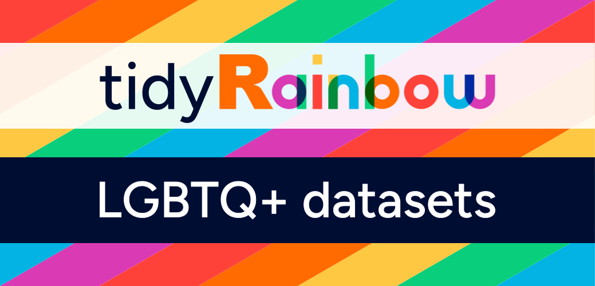
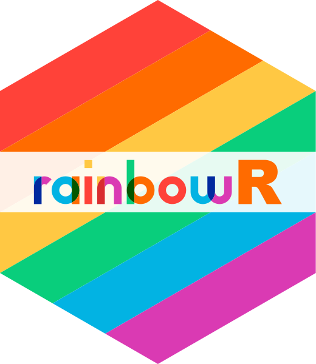

## {.inverse .center .center-h .larger200}

We [exist]{.yellow}

(Some of) what we [do]{.green}

How to [get involved]{.orange}

# [rainbowR]{.yellow} {.inverse .larger150}

a [community]{.green} that
[connects]{.red}, [supports]{.orange} and [promotes]{.yellow} [LGBTQ+]{.pink} people in the [R community]{.blue} and spreads awareness of [LGBTQ+]{.pink} issues through [data-driven activism]{.green}

## {background-image="images/rainbowR-latest-meetup.png" background-size="contain"}

## {background-image="images/rainbowR-latest-buddies.png" background-size="contain"}

## {.inverse .center-h}

[conference.rainbowr.org]{.blue .larger250}

 

[Late spring 2027]{.green .larger200}

 

. . .

[Are you interested in helping organise?]{.yellow .larger150}

## {.center-h}

{fig-align="center"}
[**github.com/r-lgbtq/tidyrainbow**](https://github.com/r-lgbtq/tidyrainbow){.larger150}

## {.inverse .center-h .center .larger250}

[rainbowr.org/join]{.yellow}

[Mastodon: tech.lgbt/@rainbowR]{.green}

[Bluesky: @rainbowr.org]{.blue}

[LinkedIn: rainbowR]{.red}

[hello@rainbowr.org]{.orange}

## {.center-h .inverse}

[rainbowr.org]{.larger250 .yellow}

